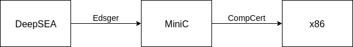
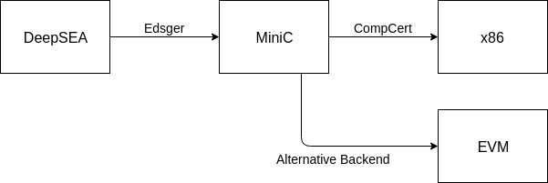
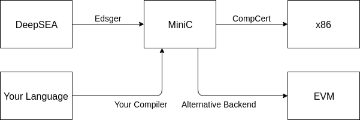
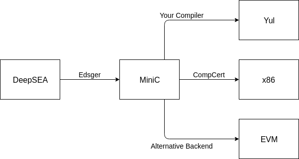

## Table of Contents

1.  [Background](#org841ee2c)
2.  [The DeepSEA Compiler](#org8d8cc17)
3.  [Project Option A](#orgdf302ec)
4.  [Project Option B](#org08c03b7)

## Background

-   [solidity docs](https://solidity.readthedocs.io/en/v0.6.2/introduction-to-smart-contracts.html#blockchain-basics)
-   [ethereum.org](https://ethereum.org/learn/#ethereum-basics)

## The DeepSEA Compiler

DeepSEA is a language developed at Yale for writing verified system software. You can read the original paper [here](http://flint.cs.yale.edu/flint/publications/deepsea19.pdf). The following is a simplified view of the architecture of the compiler.

("Edsger" is the name of the compiler.)

There is an ongoing collaboration between Yale, Columbia, and CertiK to extend the system to support the development of smart contracts. This includes an alternative backend that compiles the MiniC IR to EVM bytecode.

Here is an abbreviated informal syntax of MiniC, to give a sense of what kinds of constructs are possible.

    <expr> ::=
        const_int  <int>   <type>                 (* integer literal      *)
      | var        <ident> <type>                 (* variable             *)
      | tempvar    <ident> <type>                 (* temp variable        *)
      | deref      <expr>  <type>                 (* pointer dereference  *)
      | unop       <op>    <expr>  <type>         (* unary operation      *)
      | binop      <op>    <expr>  <expr>  <type> (* binary operation     *)
      | field      <expr>  <ident> <type>         (* access struct member *)
      | arrayderef <expr>  <expr>  <type>         (* array dereference    *)
      | hashderef  <expr>  <expr>  <type>         (* hashmap dereference  *)
      | <call>                                    (* function call        *)
    
    <statement> ::=
        skip                                            (* skip                    *)
      | assign      <expr>      <expr>                  (* write to storage        *)
      | set         <ident>     <expr>                  (* write to local variable *)
      | call        <ident>     <label>     <exprs>     (* call internal function  *)
      | sequence    <statement> <statement>             (* sequence                *)
      | ifthenelse  <expr>      <statement> <statement> (* conditional             *)
      | loop        <statement>                         (* infinite loop           *)
      | break                                           (* break                   *)
      | return      <expr>                              (* return                  *)
      | transfer    <expr>      <expr>                  (* ether transfer          *)
      | <callmethod>                                    (* call external function  *)
      | log         <expr>                              (* log                     *)
      | revert                                          (* revert                  *)

More information regarding the MiniC IR will be posted shortly.

## Project Option A

Since the existing DeepSEA language was originally designed for writing system software, it isn't a perfect fit for programmers who want a simple, high-level interface for writing contracts. The goal of this project is to design and implement such a language.

For this option, we've included a prototype language that you can either adopt directly, or use as inspiration. See [design.md](a/design.md).

## Project Option B

The details of the EVM are subject to some degree of change, and there have been proposals to replace EVM with alternative instruction sets (for example [EWASM](https://github.com/ewasm/design)). For this reason, we want the DeepSEA framework to have greater flexibility in terms of compilation targets. The goal of this project is to implement a new backend that compiles MiniC to Yul.

Information on yul can be found [here](https://solidity.readthedocs.io/en/latest/yul.html).

